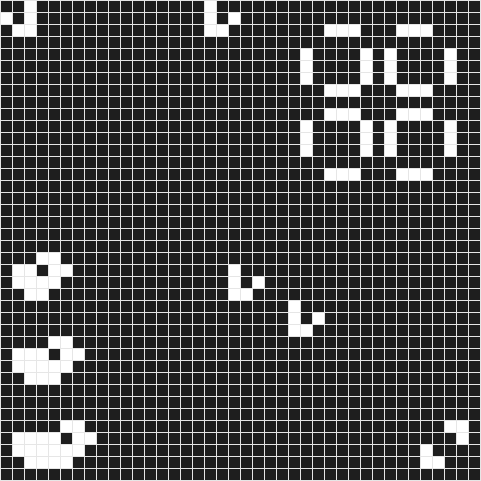

# Symulator Gry w życie Johna Conwaya

  

Symulator Gry w życie implementujący sąsiedztwa Moore'a i von Neumanna.

Funkcjonalność:

• Symulacja na mapach prostokątnych jak i torusowych

• Zapis plików graficznych do formatu .bmp

• Zapis animacji z symulacją do formatu .gif

• Zapis wybranej iteracji automatu do pliku tekstowego

• Wybór sąsiedztwa - Moore'a lub von Neumanna



  

## Kompilacja

  

Zwykła kompilacja z użyciem make

```bash

make

```

  

## Użycie

  

```text

./a.out -<flags>

-f <filename> - file with data (*required)

-i <number> - number of iterations (*required)

-s <number> - which iteration to save

-g - creates GIF animation

-t <number> - type of automaton (default: 1 )

-l - list available automata

```

Pliki wejściowe i wyjściowe opisujące są w następującym formacie:

• Pierwsza linia - liczba wierszy i kolumn

• W pozostałych liniach opis komórek na mapie gdzie 0 to komórka martwa, 1 - żywa

  

Przykład:

  

```text

5 8

0 0 0 0 0 0 1 0

0 0 0 1 1 0 0 0

0 0 1 1 0 1 0 0

0 0 1 0 0 1 0 0

0 1 0 1 0 0 0 0

```
